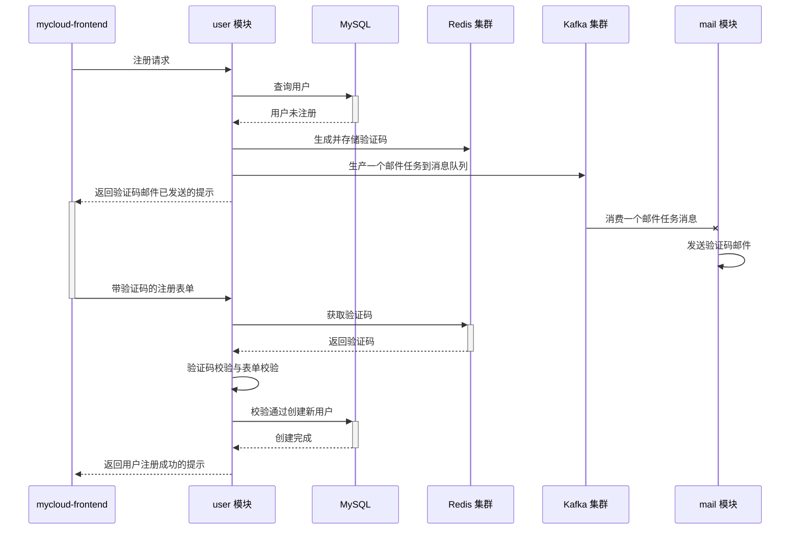

# MyCloud Project 

This is a cloud services hub, including services created by every idea.

所有有价值的创意都会集成在这个项目框架下进行孵化

## 项目构成

### 前端

#### [mycloud-frontend](https://github.com/lookoutldz/mycloud-frontend)

### 后端

#### [common-starter 模块](./common-starter/README.md)
#### [email-starter 模块(deprecated)](./email-starter/README.md)
#### [user 模块](./user/README.md)
#### [mail 模块](./mail/README.md)
#### [gateway 模块](./gateway/README.md)

### 端口范围记录

user: 8080-8089

mail: 8090-8099

gateway: 8100-8109

## 项目功能与技术

### 后端

用户登录注册重置密码等基础功能

* 基于 SpringCloud & SpringCloudAlibaba 做基础架构的微服务项目
* 采用 Nacos 集群做注册中心，方便高效
* 采用基于 Webflux 的 Spring Cloud Gateway 做服务网关，统一访问管理
* 采用新一代的 HttpClient 做 RPC 调用
* 采用 SpringSecurity 做权限校验框架，手动整合 jwt 方案做鉴权处理
* 采用 Mybatis-Plus 做 ORM 框架，使用便捷
* 采用 Redisson 做分布式锁
* 采用 Redis 集群存储注册/重置密码的邮箱验证码
* 采用 Kafka 集群存储邮件发送任务，再由监听器消费
* 采用 Nginx 做反向代理和流量控制，提高接口安全性
* 使用 AOP 做全局异常处理和统一接口返回值
* 针对多环境进行处理，不同环境使用不同配置文件
* 模块化项目功能，提高内聚性
* 引入 Docker 容器化部署，屏蔽平台差异
* 引入 Jenkins 做 CD/CI，流程化管控部署

### 前端

用户登录注册重置密码等基础功能相关页面

* 采用 Vue3 开发
* 采用 Element Plus 做 UI 组件库
* 采用 Vue-Router 做路由管理
* 采用 Axios 做异步请求框架
* 采用 Vuex 做全局变量管理
* 页面样式采用响应式设计，适配手机竖屏，平板和电脑

## 部分功能逻辑时序
### 注册

### 重置密码
同注册