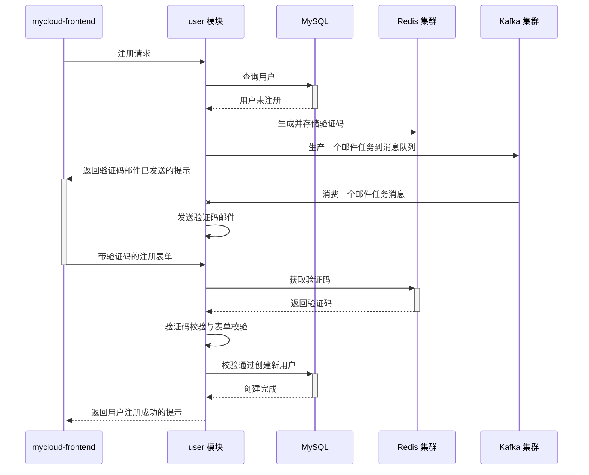

# MyCloud Project

## user 模块

### 定位

用户模块, 用于处理用户有关业务

### 逻辑时序
注册

```mermaid
sequenceDiagram
mycloud-frontend ->> user 模块 : 注册请求
user 模块 ->> + MySQL : 查询用户
MySQL -->> - user 模块 : 用户未注册
user 模块 ->> Redis 集群 : 生成并存储验证码
user 模块 ->> Kafka 集群 : 生产一个邮件任务到消息队列
user 模块 -->> + mycloud-frontend : 返回验证码邮件已发送的提示

Kafka 集群 -x user 模块 : 消费一个邮件任务消息
user 模块 ->> user 模块 : 发送验证码邮件

mycloud-frontend ->> - user 模块 : 带验证码的注册表单
user 模块 ->> + Redis 集群 : 获取验证码
Redis 集群 -->> - user 模块 : 返回验证码
user 模块 ->> user 模块 : 验证码校验与表单校验
user 模块 ->> + MySQL : 校验通过创建新用户
MySQL -->> - user 模块 : 创建完成
user 模块 -->> + mycloud-frontend : 返回用户注册成功的提示
```