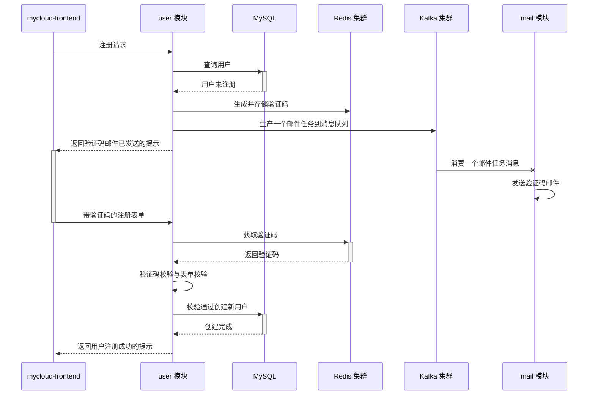

# MyCloud Project

## user 模块

### 定位

用户模块, 用于处理用户有关业务

### 逻辑时序
注册

重置密码同理

### 启动参数

JVM 参数
```text
-Xms256m
-Xmx256m
-XX:+HeapDumpBeforeFullGC
-XX:+HeapDumpOnOutOfMemoryError
-XX:HeapDumpPath=/Users/yourname/Workspaces/IdeaProjects/mycloud/user/resources/heapdump
-javaagent:/Users/yourname/Workspaces/IdeaProjects/mycloud/skywalking-agent/skywalking-agent.jar
-Dskywalking.agent.service_name=cloud-user-01
-Dskywalking.logging.file_name=cloud-user-01-api.log
```